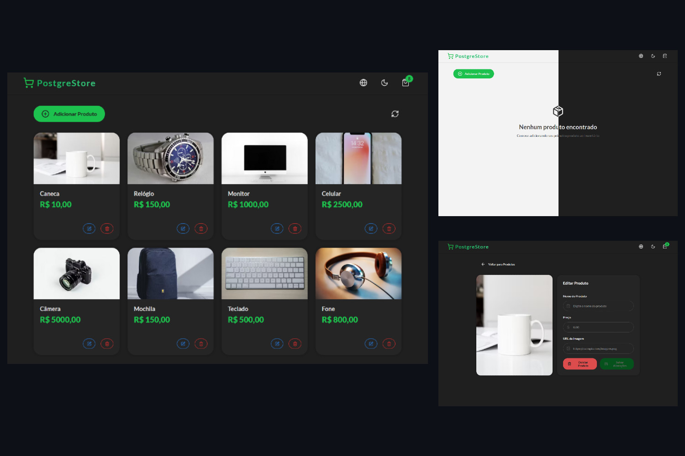

# 🛒 PostgreStore

Aplicação de uma loja com operações CRUD.



    

## 🚀 Instalação

### Pré-requisitos

- Docker

```sh
git clone https://github.com/brunotbdev/PostgreStore.git
cd postgrestore
```

### Uso

#### Iniciar o docker

```sh
docker compose up --build -d
```

O projeto estará disponivel em http://localhost:3000/

#### Adicionar alguns produtos para testes

```sh
docker exec backend node src/seeds/products.js
```

### 🛠️ Funcionalidades

- Adicionar, remover e editar produtos
- Suporte a tema claro e escuro
- Multiplos idiomas
